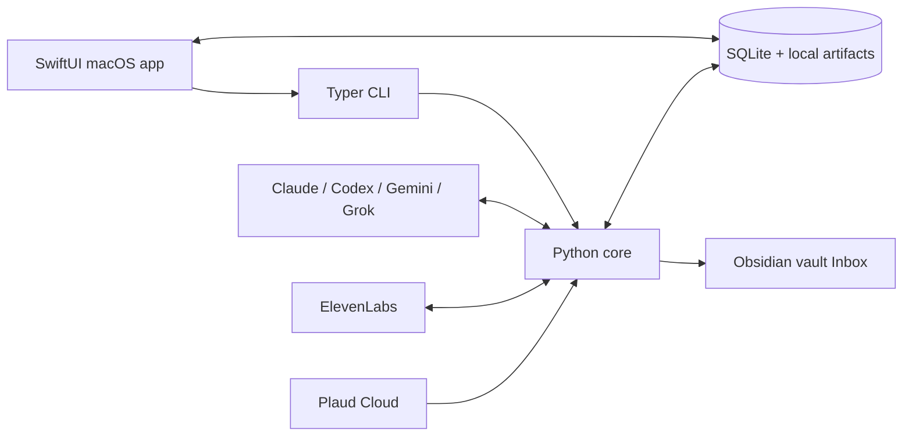
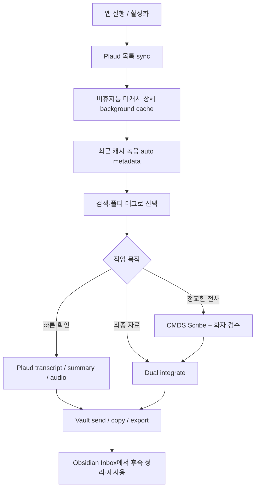

# Plaud Note Manager 기능·설계 정본

> 기준 버전: `0.8.3`  
> 기준일: 2026-09-07 (전체 검토 09-05, 인증·접근 경로 보완 09-06/07)  
> 기준 범위: 현재 개인용 저장소의 SwiftUI 앱, Python core, CLI  
> 성격: 구현된 기능, 설계 목적, 데이터·보안 경계, 미완료 항목을 한 문서에서 설명하는 현재형 문서

읽는 순서:

- 제품의 목적과 철학: §1–4
- 화면에서 쓸 수 있는 기능: §5
- 앱 뒤에서 공유하는 core/CLI: §6
- 인증·데이터·side effect: §7–9
- 성능·한계·검증 상태: §10–13
- 구현 파일 찾기: §14

`0.8.1`은 개인용 앱의 실행과 반응성을 개선한다. 태그 목록을 제한된 초기 표시와
전체 태그 검색으로 바꾸고, CLI 실행기의 출력 교착·무제한 대기, 중복 reload, 본문 렌더
중 디스크 조회를 줄였다. Cloud sync의 pagination과 batch 저장, 분류 Undo의 상태 복구도
보강했다. 전체 감사와 남은 구조 개선 제안은 `docs/REVIEW-2026-09-05.md`에 있다.

## 1. 이 앱은 무엇인가

Plaud Note Manager는 Plaud Cloud에 쌓인 녹음을 **찾고, 다시 듣고, 전사·요약하고,
분류한 뒤 Obsidian에서 재사용할 수 있게 만드는 개인용 macOS 작업대**다.

Plaud의 녹음 장치나 공식 앱을 대체하는 녹음 도구가 아니다. 이 앱이 담당하는 범위는
녹음 이후다.

```text
Plaud Cloud의 녹음
  → 로컬 동기화·캐시
  → Plaud 원본과 CMDS 전사 분리 확인
  → 메타데이터·분류·화자 검수
  → 통합 전사·요약
  → Obsidian Inbox 착륙
  → 강의·뉴스레터·연구·컨설팅 등에서 재사용
```

핵심 가치는 단순 보관이 아니라 다음의 연결에 있다.

- 녹음의 **원본 출처**를 보존한다.
- 변경 가능한 제목 대신 Plaud의 불변 `file_id`로 녹음의 정체성을 유지한다.
- Plaud 전사, ElevenLabs 전사, 모델이 만든 최종본을 서로 섞지 않는다.
- 자동화가 판단을 숨기지 않도록 분류·화자·볼트 송출에 검수 지점을 둔다.
- 생성 결과를 채팅에 가두지 않고 SQLite, Markdown, JSON, Obsidian 노트로 남긴다.

## 2. 상태 표기

이 문서에서는 계획과 구현을 혼동하지 않기 위해 기능 상태를 다음처럼 표시한다.

| 표기 | 의미 |
|---|---|
| **구현됨** | 현재 소스에서 UI 또는 CLI와 core까지 연결돼 있다. |
| **환경 조건부** | 구현은 됐지만 Plaud 세션, 외부 CLI, API 키, 볼트 경로 같은 로컬 조건이 필요하다. |
| **부분 구현** | 핵심 경로는 있으나 UI, 복구, 검증 또는 일부 세부 동작이 완결되지 않았다. |
| **미구현** | 계획서에 있거나 확장 여지는 있지만 현재 제품 기능은 아니다. |
| **라이브 미검증** | 소스와 단위 테스트는 있으나 이번 문서 작업에서 실제 외부 계정 side effect를 실행하지 않았다. |

`구현됨`은 “모든 계정과 모든 환경에서 성공이 보장된다”는 뜻이 아니다. 특히 Plaud
private API, 브라우저 로그인, 유료 AI 서비스, 실제 Obsidian 파일 쓰기는 각각의 실행
환경에서 따로 확인해야 한다.

## 3. 제품 설계 원리

### 3.1 하나의 core, 여러 surface

인증, Plaud API, 저장, 분류, 전사, 요약, 볼트 송출 규칙은 Python `core/`에 둔다.
CLI, SwiftUI 앱, skill, 향후 agent는 이를 호출하는 surface다.



이 구조의 목적은 화면마다 Plaud API, 인증, 분류 로직을 복제하지 않는 것이다. Cloud,
AI, transcription, vault 작업은 같은 `plaud` CLI/core 계약을 통과한다. SwiftUI는 GRDB로
SQLite를 직접 조회·검색하고 seen/star 같은 로컬 상태는 직접 쓴다. 따라서 터미널과 앱은
같은 `file_id`, 같은 DB, 같은 taxonomy와 출력 경로를 공유한다.

### 3.2 `file_id`를 정체성으로 사용

녹음 제목, 폴더, 사용 상태는 바뀔 수 있다. Plaud의 `file_id`는 다음을 묶는 안정적인
키다.

- Cloud 파일 메타데이터
- Plaud 전사·요약 캐시
- CMDS/ElevenLabs 전사
- 모델별 요약 슬롯
- 통합 전사·종합 요약
- 태그, 수명주기, 재사용 상태
- Obsidian에 만들어진 노트 참조

로컬 산출물도 `data/transcripts/{file_id}`, `data/summaries/{file_id}`,
`data/integrated/{file_id}` 아래에 둔다. 제목을 바꿔도 연결이 끊기지 않게 하기 위함이다.

### 3.3 원본, 독립 전사, 최종본을 분리

상세 화면은 세 출처를 명시적으로 나눈다.

| 레이어 | 역할 | 신뢰 경계 |
|---|---|---|
| **Plaud** | Plaud가 제공한 transcript, summary, outline | 서버 원본이지만 전사·화자 귀속이 항상 정확하다고 가정하지 않는다. |
| **CMDS** | ElevenLabs Scribe 기반 독립 전사와 로컬 화자 편집 | diarization이 강점이지만 단어 누락과 화자 추정 오류가 가능하다. |
| **Final** | 두 전사와 Plaud 요약을 교차분석한 통합 transcript·summary | 생성 모델의 결과이므로 원본을 대체하지 않고 별도 아티팩트로 저장한다. |

목적은 “가장 그럴듯한 텍스트 하나”를 만드는 데 그치지 않고, 나중에 무엇이 원본이고
무엇이 가공 결과인지 추적할 수 있게 하는 것이다.

### 3.4 로컬 우선, Cloud 변경은 명시적으로

목록, 검색, 읽음, 별표, 메타데이터, 태그, 진행 상태는 로컬 DB에서 빠르게 처리한다.
서버 폴더 이동, 제목 변경, Plaud 전사 화자명 변경처럼 Cloud를 바꾸는 작업은 별도
명령으로 실행한다.

- `seen_at`, `starred`, `usage_status`, reuse 상태는 로컬 전용이다.
- Plaud 폴더, 제목, 서버 전사 화자명은 원격 변경이다.
- `Archive`는 로컬 수명주기이며 Plaud의 `Trash`와 다르다.
- 앱에는 Plaud Cloud 파일 삭제·복원 기능이 없다.

폴더 이동과 제목 변경은 반응성을 위해 로컬 DB를 먼저 바꾸고 원격 CLI를 background에서
실행한다. 현재 실패 시 즉시 rollback하지 않으므로 다음 sync까지 local/cloud 표시가
어긋날 수 있다.

### 3.5 규칙 우선, 모델은 약한 판정만 보조

자동 폴더 분류는 먼저 deterministic taxonomy rule을 적용한다. 기본 버킷이거나
신뢰도가 낮을 때만 LLM이 **기존 taxonomy 안에서** 후보를 고른다. 모델이 임의의 새
폴더 체계를 만들지 못하게 하는 닫힌 선택 구조다.

앱에서는 dry run 결과를 먼저 보여주고 다음을 사용자가 결정한다.

- 적용할 녹음 선택
- 제안 폴더 또는 차점 후보 선택
- 신뢰도와 판정 이유 확인
- LLM 중재 여부 확인
- 선택한 항목만 실제 적용

### 3.6 자동화와 human gate의 결합

비용이 크거나 의미가 바뀌는 작업은 중간 상태를 저장하고 사람이 확인할 수 있게 한다.

- 화자 실명: 모델 제안 → confidence/evidence 확인 → 사용자 수정·확정
- Dual pipeline: 전사 → 화자 확인 대기 → 통합 → 볼트 송출 대기
- 자동 분류: preview → 선택 → apply
- Obsidian: 일반 송출은 기본 Inbox 또는 사용자가 고른 목적지로 보내고, Dual은 전용
  Plaud Inbox lane에 착륙시킨다. 영구노트 승격·최종 분류는 자동 수행하지 않는다.

### 3.7 상태를 문자열이 아니라 실제 아티팩트에서 파생

라이브러리 진행률은 임의로 바꾸는 상태값보다 존재하는 결과물을 기준으로 계산한다.

```text
New → Cached → Transcribed → Integrated
```

- `Cached`: Plaud 본문 캐시가 있음
- `Transcribed`: CMDS 전사가 있음
- `Integrated`: integrated directory에 Markdown artifact가 있음

이 방식은 작업이 중단되거나 다시 시작돼도 디스크에 남은 사실과 UI 표시가 어긋나는
문제를 줄인다.

### 3.8 실패 시 기존 자격증명을 보존

인증 입력 경로마다 검증 수준을 구분한다. 앱의 cURL 복구 경로는 형식·host와 실제
Plaud 응답을 확인하고, 검증 실패나 네트워크 불가 시 기존 Keychain을 바꾸지 않는다.
반면 CLI `refresh-auth`는 live 검증이 기본값이 아니며, Web Login import는 live probe가
불가능하면 `unverified` 상태로 저장할 수 있다. 회전하는 access/refresh token은 하나의
원자적 Keychain 항목으로 함께 교체한다.

목적은 다음 실패를 막는 것이다.

- 잘못 복사한 cURL이 정상 자격증명을 덮어씀
- access token만 새 세대이고 refresh token은 구세대로 남음
- 앱과 CLI가 동시에 refresh하여 rotation chain이 깨짐
- Keychain 저장 실패 뒤 `.env` 원본까지 지워짐

### 3.9 비용과 컨텍스트를 필요한 만큼만 사용

core는 `L0 peek → L1 brief → L2 outline → L3 deep`의 점진적 조회를 제공한다.
전체 transcript를 항상 모델에 넣지 않고 후보를 먼저 좁히기 위함이다. AI 작업도
규칙과 로컬 캐시로 해결할 수 있는 부분을 먼저 처리하고, 외부 모델 호출은 명시적인
생성 또는 약한 판정의 중재에 사용한다.

## 4. 대표 사용자 흐름

### 4.1 일상 흐름



### 4.2 앱 실행 중 백그라운드 흐름

- 앱 시작과 재활성화 시 목록을 동기화한다.
- 활성 상태에서만 약 30초 간격으로 Cloud를 확인한다.
- sync 후 상세 content가 없는 항목을 background backfill한다. 빈 응답은 1시간, 실패는 5분 뒤 재시도하며 Cloud edit_time 변경과 수동 `--force`는 대기를 건너뛴다. 빈 응답을 캐시 완료로 오인하지 않는다.
- 설정이 켜져 있으면 최근의 eligible recording에 auto metadata를 생성한다.
- SQLite/WAL 변화는 감시하되 실제 signature가 바뀔 때만 UI를 다시 읽는다.
- 검색과 상세 로드에는 debounce 또는 generation guard를 둬 오래된 조회 결과가 새 선택을
  덮지 않게 한다. 일반 장기 CLI job 전체에 같은 guard가 적용되는 것은 아니다.

## 5. macOS 앱 기능

### 5.1 네이티브 작업대

**상태: 구현됨**

- macOS 14+ SwiftUI 앱
- 3열 구조: 라이브러리 사이드바 → 녹음 목록 → 상세 작업 공간
- 상세 오른쪽에 접을 수 있는 Work Sidebar
- 기본 창 1608×854, 최소 1280×800
- System, Light, Dark appearance
- 2줄 조밀 / 3줄 여유 목록 밀도
- Raw / Rendered 기본 보기 저장
- Work Sidebar 표시·폭, 검색 범위, 태그 보기, 목록 밀도 등의 로컬 설정 유지
- Settings 단축키 `⌘,`, Command Palette `⌘K`

목적은 1,000개 이상의 녹음을 Finder식으로 훑으면서도 선택한 녹음의 원본, 가공,
송출 작업을 한 창 안에서 이어가는 것이다.

macOS state restoration은 명시적으로 끈다. main sidebar 선택, selected recording, source
tab, CMDS speaker count·gap 같은 작업 중 선택은 앱을 다시 열면 초기값으로 돌아간다.

### 5.2 툴바

**상태: 구현됨**

| 기능 | 동작 | 목적 |
|---|---|---|
| Settings | 화면·모델·자동화·출력 경로 설정 | 작업 환경을 앱 안에서 조정 |
| Deep Sync | 비휴지통의 미캐시 상세를 장기 backfill | 이후 클릭과 검색을 빠르게 준비 |
| Auto-classify | 분류 dry run과 검수 sheet | 원격 폴더 변경 전 확인 |
| Sync | 즉시 Cloud metadata sync | 최신 녹음·폴더 반영 |
| Auth indicator | 인증, 만료, 자동 갱신 상태 | 실패 원인을 로그인/네트워크/설정으로 구분 |

Deep Sync는 장시간 걸릴 수 있고 현재 취소 버튼은 없다. 중복 실행은 막고 진행 수치만
표시한다.

### 5.3 라이브러리 사이드바

**상태: 구현됨. 폴더 icon 재편집은 부분 구현**

- All files, Unfiled, Starred, Trash와 각 개수
- Plaud 폴더와 파일 수
- 폴더 생성, 이름·색상 수정, 삭제
- 녹음을 폴더에 drag-and-drop
- Unfiled에 drop하여 폴더 해제
- 태그별 파일 수
- 전체 태그 검색, 초기 80행 표시와 80행씩 더 보기
- 태그 고정/해제
- 빈도순/가나다순 정렬
- 평면 태그 / `parent/child` 중첩 트리 전환
- 부모 prefix 전체 필터 / 자식 exact 필터
- sidebar footer에 app version과 build 표시; source SHA는 Settings에서 표시

폴더는 제품 규칙상 파일당 하나만 허용한다. 이름과 색상 편집은 연결돼 있으나 custom
icon은 기존 icon 조회·prefill이 완결되지 않아 **부분 구현**으로 본다.

태그 정렬·중첩 표시는 background에서 안정적인 ID를 가진 평면 행으로 계산한다.
수천 개 태그를 SwiftUI 재귀 outline에 한 번에 넣지 않으며 검색은 초기 표시 수와
무관하게 전체 태그를 대상으로 한다. 선택한 parent/child의 필터 의미는 유지한다.

폴더 삭제는 Plaud Cloud mutation이며 현재 앱에는 별도 확인 dialog가 없다.

`Trash`는 Plaud가 이미 trash로 표시한 항목을 보는 필터다. 앱에서 Cloud 파일을
삭제하거나 복원하지 않는다.

### 5.4 목록과 검색

**상태: 구현됨**

- All / Unfiled / Cached 지표
- ElevenLabs 남은 STT credit, plan, reset date
- 파일명 검색
- 캐시된 transcript·summary 전체 내용 검색
- FTS5가 지원될 때 trigram relevance 정렬
- FTS 경로에서는 검색어 주변 snippet과 일치 부분 강조
- 두 글자 한국어 등 짧은 검색어는 `LIKE` fallback
- 현재 sidebar 범위 안에서 검색
- unread, cached, star, Dual 단계의 시각적 상태
- context menu, swipe action, drag-and-drop

행에서 가능한 주요 동작은 다음과 같다.

- Star / Unstar
- Rename
- Plaud Web 열기 / URL 복사
- Move / Unfile
- Archive / Unarchive
- CMDS 전사
- legacy `plaud obsidian` 송출

전체 내용 검색은 로컬에 content가 캐시된 녹음만 대상으로 하며 결과는 최대 200개,
앱 master list는 최대 5,000개다. 짧은 검색어의 `LIKE` fallback은 match-centered highlight가
아니라 title/summary 앞부분 preview를 보여준다.

ElevenLabs 잔액은 최대 30분 동안 cache하며 전사 완료 뒤에는 강제로 새로 읽는다. 따라서
항상 실시간 수치라고 보장하지 않는다. Cached 지표의 분자·분모는 모두 비휴지통 파일을
대상으로 한다. 자동 backfill 여부도 새 DB 집계로 판단해 trash cache 때문에 필요한 작업이
생략되지 않게 한다.

녹음을 선택하면 `seen_at`이 즉시 로컬 DB에 기록된다. 현재 Mark as Unread 동작은 없다.

### 5.5 녹음 상세 헤더

**상태: 구현됨**

- 제목 inline 편집: Enter 저장, Esc 또는 focus out 취소
- 상세 content 강제 재조회
- Plaud Web 열기
- 녹음 시각, 길이, 폴더, 진행 상태, 사용 상태
- `file_id` 표시
- Plaud keyword 표시와 keyword 기반 목록 검색
- `New → Cached → Transcribed → Integrated` 진행률

### 5.6 오디오 재생과 내보내기

**상태: 환경 조건부**

- Plaud에서 short-lived signed URL을 새로 받아 AVPlayer로 스트리밍
- URL 만료·player 오류 표시와 reload
- 저장 위치를 고른 뒤 audio 다운로드
- 다운로드 성공 시 Finder에서 결과 reveal
- Plaud transcript, notes, outline을 Save Panel로 export
- Final/slot 생성 결과는 copy, vault send, output folder 열기

signed URL이나 원본 audio 자체를 영구 자격증명으로 취급하지 않는다. S3 계열 download
요청에는 Plaud authorization header를 전달하지 않는 별도 HTTP client를 쓴다.

### 5.7 Plaud 원본 패널

**상태: 구현됨**

- Transcript, 여러 Plaud Summary, Outline 탭
- Raw / Rendered 전환
- Raw 줄바꿈 / 가로 스크롤
- 화자별 transcript bubble
- 제목, 목록, 인용, 코드, 구분선을 포함한 Markdown 렌더링
- 전체 package 또는 개별 section 복사
- 한 파일의 Plaud 서버 transcript 화자명 변경 후 re-fetch

서버 transcript 화자명 변경은 Cloud side effect다. 원래 화자 필드를 보존하도록 요청을
구성하지만, 전체 voiceprint roster rename과는 다른 **파일 단위** 기능이다.

### 5.8 CMDS / ElevenLabs 패널

**상태: 환경 조건부**

- ElevenLabs Scribe 전사
- 화자 수 Auto 또는 1–10 지정
- diarization과 word timestamp 사용
- 3–60초 silence gap으로 conversation section 분할
- section별 화자를 saved speaker와 매핑
- section별 적용 / 전체 적용
- 전체 / section별 클립보드 복사
- saved speaker 추가·삭제, `Self` 지정
- `Self` 화자 전용 정렬과 색상

목적은 Plaud transcript를 덮어쓰는 것이 아니라 독립적인 두 번째 관측을 얻는 것이다.
원본 audio는 전사를 위해 ElevenLabs 외부 서비스로 전송되며, 화자 label과 실명 후보는
사람 확인 전에는 추정값이다.

### 5.9 Final 패널

**상태: 환경 조건부**

- Plaud와 CMDS를 교차분석한 최종 transcript
- 종합 summary
- Raw / Rendered 보기
- transcript만, summary만, 둘을 합친 context block 복사
- 최종본이 없을 때 Dual Transcribe 시작 안내

최종본은 Plaud 원본을 수정하지 않고 `data/integrated/{file_id}`에 별도 저장한다.

### 5.10 메타데이터, 태그, 수명주기

**상태: 구현됨. AI 생성은 환경 조건부**

- 파일당 하나의 Plaud folder를 radio 방식으로 지정
- 로컬 태그 추가·삭제
- 기존 태그 autocomplete
- AI metadata와 auto tag 생성
- CMDS meeting note 생성
- 생성된 Obsidian note 열기
- note type, description, folder, usage status, tag 표시
- `final_note_path`가 있으면 생성된 Obsidian note 열기

core/DB에는 metadata title, category, vault path, references도 저장되지만 현재 MetadataBar가
이 필드들을 모두 직접 표시하는 것은 아니다.

사용 상태는 다음 다섯 가지다.

| 내부 값 | 화면 의미 | 용도 |
|---|---|---|
| `unused` | Not Used | 아직 후속 활용하지 않음 |
| `metadata-ready` | Metadata Ready | 정리용 metadata가 준비됨 |
| `vault-linked` | Vault Linked | Obsidian note와 연결됨 |
| `used-elsewhere` | Used Elsewhere | 앱 밖 다른 맥락에서 활용함 |
| `archived` | Archived | 로컬 lifecycle 표식; All 목록에서 자동으로 숨기지는 않음 |

`archived`는 Plaud Trash 이동이 아니다.

자동 metadata는 기본적으로 최근 7일의 cached item을 대상으로 하고, Plaud transcript,
primary summary, extra summaries의 source hash로 같은 입력을 중복 처리하지 않는다.
실패 시 1시간부터 최대 24시간까지 backoff한다.
sync 뒤의 auto metadata는 folder를 **추천만** 한다. 반면 사용자가 명시적으로 실행하는
`metadata-generate`는 기본 CLI 계약상 confidence 0.5 이상일 때 Plaud folder를 실제로
이동할 수 있다.

수동 tag는 AI/auto 재생성보다 우선하며 자동 작업이 같은 tag를 덮어 소유권을 바꾸지
않는다.

### 5.11 자동 폴더 분류

**상태: 구현됨. 적용은 Cloud side effect**

- rules-first 분류
- 약한 verdict에만 LLM arbitration
- dry run preview
- confidence 0.5 이상 기본 선택
- 항목별 선택 해제·재선택
- 차점 후보로 override
- 이유, confidence, LLM 중재 badge
- CMDS category / index mapping 표시
- 선택 항목만 apply

taxonomy는 `data/classification.json`의 개인 설정이 있으면 이를 우선하고, 없으면 built-in
기본값을 사용한다. 폴더 개수를 고정된 제품 상수로 보지 않는다.

`classify-undo`는 `0.8.1`에서 version 2 snapshot을 사용한다. 새 분류 작업은 변경 전후의
폴더, metadata, 태그를 기록하고, Undo는 기존 Cloud 폴더와 로컬 상태를 복구한다.
분류 이후 사용자나 다른 작업이 상태를 바꾼 항목은 덮어쓰지 않고 건너뛰며, 실패한 항목의 manifest를
보존해 재시도할 수 있게 한다. 앱의 여러 폴더 override 적용은 하나의 Undo 그룹에
연결된다. **이전 버전 manifest에는 원래 snapshot이 없으므로 폴더를 Unfiled로 되돌리는
제한된 호환 복구만 가능하다.** 새 Undo의 실제 Cloud 변경 성공은 별도 라이브 확인 대상이다.

### 5.12 Dual Transcribe pipeline

**상태: 구현됨. 외부 서비스와 사람 확인 필요**

```text
marked
  → transcribing
  → relabel-pending
  → integrating
  → vault-ready
  → vault-sent
```

기능:

- 한 녹음을 Dual 작업 대상으로 mark
- 기존 CMDS 전사가 없으면 ElevenLabs 실행
- Plaud, ElevenLabs, vault 문맥으로 화자 실명 후보 제안
- 이름, confidence, evidence를 보여주고 사용자가 수정·확정
- 확정 이름을 transcript 전체와 saved speaker roster에 반영
- Plaud×CMDS 통합 transcript와 종합 summary 생성
- `vault-ready`에서 멈춘 뒤 사용자가 별도로 send
- 실패 당시 stage와 error를 저장하고, 재실행 시 기존 artifact를 검사해 누락 단계를 재시도
- 이미 있는 content, transcript, speaker map, integrated artifact 재사용
- pipeline mark 제거; 생성 artifact 자체는 보존

비용이 큰 전사·통합을 중복 실행하지 않고, 실명과 외부 파일 쓰기는 자동 추론만으로
통과시키지 않는 것이 목적이다. `toVault` 자동 착륙 경로는 core에 있으나 현재 UI는 이를
쓰지 않고 `vault-ready` human gate를 유지한다.

### 5.13 콘텐츠 재사용 상태

**상태: 핵심 칩 구현, 확장 UI는 부분 구현**

녹음 수명주기와 별개로 다음 output channel을 표시한다.

- newsletter
- lecture
- shorts
- sns
- consulting
- research

core/CLI에는 범용 `other` channel도 있으며 현재 앱 chip에는 노출되지 않는다.

각 chip은 다음처럼 순환한다.

```text
none → flagged → drafted → published → none
```

이 축을 `usage_status`와 분리한 이유는 “정리됐는가”와 “어디에 재사용할 것인가”가 서로
다른 질문이기 때문이다. core에는 channel별 note 저장과 query가 있으나 현재 앱에는
reuse smart sidebar, quote 후보, note 편집 UI가 없다.

### 5.14 Work Sidebar와 AI Summary Slot

**상태: 환경 조건부**

Work Sidebar:

- 접기/복원과 폭 기억
- integrated output folder 열기
- prompt templates folder 열기
- Vault send
- Metadata 생성
- Meeting note 생성
- Summary slot 추가
- 모든 slot을 Integrated mode로 생성
- Claude Code bridge

Summary slot:

- 사용자 정의 slot name
- Claude, Codex, Gemini, Grok provider
- provider별 model ID 또는 vault preset
- prompt template
- Summary / Integrated mode
- 생성, 재생성, slot 설정 삭제
- 결과 inline show/hide, 확대 sheet, copy
- 한 slot 결과만 Vault로 send
- Integrated 결과의 All / Transcript / Summary 분리 보기

slot의 name, provider/model, model ID, template은 Python과 공유하는 `data/slots.json`에
저장한다. Summary / Integrated mode 선택은 현재 Swift 화면의 일시적 상태이며 앱을 다시
열 때 유지되지 않는다. 결과 파일에는 `file_id`, provider, model, template을 남겨 어떤
생성 경로였는지 추적한다. slot 삭제는 설정만 지우며 기존 output artifact는 보존한다.

CLI backend가 기본이며 각 vendor의 subscription/OAuth session을 쓴다. CLI mode에서는
같은 provider의 API key 환경변수를 제거해 실수로 direct API 과금 경로를 타지 않게 한다.
API backend는 사용자가 명시적으로 선택할 수 있으며 별도 과금이 가능하다.

### 5.15 Claude Code bridge

**상태: 환경 조건부**

- 선택한 recording에 질문
- follow-up draft
- recent recording digest
- 현재 recording context를 넣은 Claude Code session 시작

이는 앱 안의 chat UI가 아니다. Terminal의 Claude Code를 여는 bridge이며 Claude CLI
설치와 로그인 상태가 필요하다.

### 5.16 Obsidian / Vault 송출

**상태: 환경 조건부, 실제 파일 쓰기**

지원 경로:

- Main Vault Inbox에 integrated-first direct send
- transcript 포함 옵션
- `60. Collections/63. Meetings` 목적지
- Wiki Vault Inbox
- Claude headless 정형화 후 저장
- Claude Terminal interactive filing
- 개별 summary slot 결과만 전송
- Dual transcript 전용 Plaud Inbox lane

content 선택 우선순위는 통합본, slot summary, Plaud summary 순이다. direct도 preview가
아니라 실제 vault 파일을 쓴다. 같은 파일명이 있으면 `(2)`, `(3)` suffix로 기존 파일을
보존하고, 만들어진 note path를 로컬 DB reference에 기록한다.

direct, Dual, deterministic fallback 경로는 공통 frontmatter builder를 사용해 다음
규칙을 적용한다.

- CMDS 7필드: `type`, `aliases`, `description`, `author`, `date created`,
  `date modified`, `tags`; 다만 author 설정이 비어 있으면 builder도 `author`를 생략한다.
- ISO 8601 minute 날짜
- 영어·큰따옴표 description
- YAML 안의 quoted wikilink
- model / effort
- CMDS / index / source / `plaud_id`
- Dual / speakers / keywords / related
- reuse channel 상태
- cross-vault link는 일반 wikilink 대신 Advanced URI

related note는 기본적으로 실제 vault의 title 또는 alias와 정확히 resolve된 항목만 넣는다.
semantic fuzzy matching이 아니다. model 정보가 없으면 `model`/`effort`도 생략될 수 있다.
headless AI가 완성 frontmatter를 반환하는 경로, Claude Terminal이 직접 쓰는 경로,
AI meeting note 경로는 builder가 결과를 다시 강제하지 않고 prompt 계약에 의존하므로
`vault-lint`로 확인해야 한다.

일반 `vault-send`는 Main Inbox가 기본이지만 Meetings, Wiki, 또는 지정한 목적지를 쓸 수
있다. Dual output만 고정 Plaud transcript Inbox lane에 착륙한다. 어느 경로도 영구노트
승격이나 최종 publish까지 자동 결정하지 않으며 그 단계는 vault-side workflow가 담당한다.

목록 context menu에 남아 있는 `Send to Obsidian`은 구형 `plaud obsidian` 경로다. Work
Sidebar와 Command Palette의 `vault-send`가 현재 통합본 우선 송출 경로다.

### 5.17 Command Palette

**상태: 구현됨**

`⌘K`를 누르면 검색 가능한 command menu가 열린다. 화살표, Enter, Esc와 검색어가 없을
때의 single-key trigger를 지원한다.

- Archive / Unarchive
- Star / Unstar
- Move to Folder / Unfile
- Generate Metadata
- Transcribe with CMDS
- Main Vault / Wiki Vault / Claude Vault send
- Plaud Web 열기 / URL 복사
- Rename
- Re-fetch Detail
- 최근 auto-classify undo
- All / Unfiled / Starred / Trash / 각 folder로 이동

### 5.18 Settings

**상태: 구현됨. 일부 외부 설정은 CLI 필요**

- Default view: Raw / Rendered
- Appearance: System / Dark / Light
- provider별 backend: CLI subscription/OAuth / API
- provider별 model ID와 vault preset
- LLM CLI 설치·로그인·account·API env 상태 확인
- auto-classify model
- metadata model
- auto metadata on/off
- transcript / summaries / integrated output path
- version / build / source SHA

LLM 로그인은 앱이 password를 받거나 대신 입력하지 않는다. Settings에서는 상태를 확인하고
필요한 terminal login command를 안내한다. Vault root 설정도 현재 앱 form에는 없으므로
`PLAUD_OBSIDIAN_VAULT` 또는 `plaud config-vault`를 사용한다.

output path override는 slot과 Final의 integrated artifact 조회, Work Sidebar의 integrated
folder 열기에도 반영된다. Python과 Swift의 기본 backend는 4사 모두 CLI이며, 저장된
사용자 설정이 우선한다. 외부 locator의 override 열거 범위는 별도 제한으로 남아 있다.

## 6. Python core와 CLI에서 제공하는 기능

현재 CLI help에는 101개의 command가 노출된다. 아래는 기능군별 계약이며, 모든
command를 앱 UI가 직접 보여주는 것은 아니다.

### 6.1 조회와 progressive disclosure

**상태: 구현됨, 주로 CLI/외부 자동화용**

- `peek`: L0, filename/date/duration/folder/cache
- `brief`: L1, metadata/tag/vault link/speaker 추가
- `outline-of`: L2, summary·outline·integrated preview
- `deep`: L3, 필요한 section의 전체 content
- `query`: keyword, tag, folder, vault note 조합 검색
- `resources`: 로컬 artifact 목록과 manifest
- `show`: `plaud://` URI 또는 path의 내용 출력

기본 output 경로에 있는 지원 대상 Markdown artifact에는 다음과 같은 안정적인 locator를
부여한다.

```text
plaud://cmds-transcript/{file_id}
plaud://summary/{file_id}/{model}/{template}
plaud://integrated-summary/{file_id}/{model}/{template}
```

외부 embedding/RAG pipeline이 앱 내부 테이블 구조에 결합되지 않고 `file_id`, kind,
model, template, mtime, path를 통해 증분 인덱싱할 수 있게 하기 위함이다. 현재 locator는
output path override와 `cmds.transcript.json`까지 열거하지는 않는다.

### 6.2 Cloud sync와 파일 관리

**상태: 구현됨, Plaud private API 의존**

- 빠른 metadata-only `sync`
- active/trash 목록 pagination, 페이지 단위 SQLite batch 저장, 반복 페이지 오류 검출
- content 없는 recording의 `sync-content` backfill
- folder list/create/rename/delete
- single-folder `move`
- 다중 folder mapping 검사·수정 `folder-doctor`
- title rename
- detail, transcript, summary, outline 조회
- audio download와 temporary stream URL
- Plaud Web URL open/copy
- 서버 transcript의 파일 단위 speaker relabel
- 서버 AI note content/title edit
- 서버 voiceprint speaker roster 조회·rename

서버 voiceprint roster API의 응답 wrapper는 소스상 live 검증 메모가 남아 있으므로 계정별
실사용 전 확인 대상이다.

### 6.3 로컬 검색과 캐시 유지보수

**상태: 구현됨**

- cached content full-text search
- search index rebuild
- 과거에 저장된 stale empty cache prune
- content 강제 re-fetch
- artifact-derived library status/dashboard

`sync-content`는 처리 성공과 실패 수를 구분하고 실패가 있으면 비정상 종료 코드를
반환한다. 분류 등 metadata 일부를 바꾸는 upsert는 기존 읽음·사용 상태와 관계 metadata를
보존하며, 값을 비우는 Undo는 일반 upsert와 구분된 복구 계약을 사용한다.

Plaud가 아직 processing 중이라 transcript, summary, outline이 모두 빈 경우 새 empty cache를
저장하지 않는다. 나중에 content가 완성됐을 때 다시 가져올 수 있게 하기 위함이다.

### 6.4 태그, metadata, taxonomy

**상태: 구현됨**

- metadata 조회·생성·자동 batch
- usage status 설정
- tag add/remove/list/all
- tag pin/unpin
- taxonomy plan과 upgrade
- classification dry run/apply
- classify/metadata 기본 model과 LLM assist 설정

metadata 입력에는 filename, Plaud keyword·summary, Plaud/CMDS transcript, integrated
summary, speaker, vault context가 포함될 수 있다. AI가 비활성화됐거나 model을 사용할 수
없거나 유효한 metadata가 나오지 않으면 deterministic fallback을 쓴다. 실제 provider 호출
중 runtime error는 성공으로 바꾸지 않고 실패를 기록하며, auto batch는 backoff한다.
model 미설정 상태에서 낮은 품질의 대량 fallback을 만드는 대신 batch를 멈춘다.

### 6.5 전사, 화자, 요약, 통합

**상태: 외부 서비스 조건부**

- ElevenLabs credit status
- CMDS transcription
- local CMDS speaker relabel
- saved speaker roster
- Plaud server transcript speaker relabel
- provider×template summary
- Plaud×CMDS integrated transcript·summary
- reusable summary slot CRUD

### 6.6 Dual pipeline와 reuse query

**상태: 구현됨**

- Dual mark/resume/status/speaker proposal/send/unmark
- channel별 reuse mark
- channel별 재사용 후보 query
- reuse note 저장

앱은 핵심 mark UI만 제공하지만 CLI는 “newsletter용 flagged material”처럼 channel별로
후보를 다시 찾는 query까지 지원한다.

### 6.7 Vault 도구

**상태: 환경 조건부**

- vault index와 incremental refresh
- Plaud keyword ↔ vault title/alias 연결
- integrated-first vault send
- meeting note 생성
- Plaud Inbox용 Obsidian Bases view 설치
- Plaud lane frontmatter lint
- config-vault / config-wiki-vault / config-author

incremental vault index는 변경 파일 upsert는 하지만 삭제·이동된 note를 자동 purge하는
완전한 reconciliation은 아직 없다. YAML parser도 nested mapping 전체를 지원하지 않는다.

### 6.8 인증과 모델 상태 도구

**상태: 구현됨, 계정·브라우저 환경 조건부**

- Plaud auth 상태와 optional live probe
- fresh cURL import
- embedded Web Login capture import
- workspace refresh bootstrap과 headless refresh
- browser session 기반 auth recovery
- Claude/Codex/Gemini/Grok CLI OAuth 상태 확인
- vendor CLI interactive login 시작
- backend/model/path 설정

## 7. 인증 설계

### 7.1 Plaud의 두 인증 수명

앱은 현재 API 호출에 쓰는 workspace access token과, 이를 다시 발급하기 위한 더 긴 계정
session을 구분한다.

```text
현재 API access
  └─ rotating workspace refresh token으로 headless 갱신
       └─ 실패 시 persistent WebKit account session에서 새 workspace pair 발급
            └─ account session도 만료됐을 때만 사용자 로그인
```

이를 통해 사용자가 매번 cURL을 다시 복사하지 않게 하되, account password 자체는 앱이
보관하지 않는다.

### 7.2 자동 복구와 사용자 fallback

앱의 자동 self-heal은 다음 순서다.

1. Keychain에 저장된 workspace refresh token
2. hidden persistent WebKit account session
3. 둘 다 실패하거나 제한 시간을 넘으면 Auth sheet 표시

Auth sheet에서는 하나의 강제 순서가 아니라 다음 fallback 중 하나를 사용자가 선택한다.

- 사용자가 명시적으로 선택한 `Chrome 연결`
- copied cURL import
- 독립 창의 Plaud Web Login

CLI `auth-recover`는 별도 흐름이다. 저장된 refresh를 먼저 확인하고 Chrome disk,
Chrome AppleScript, cmux 순으로 workspace 정보를 찾는다. 모두 실패하면 호출자가 독립 창
login 같은 interactive 경로로 넘어가야 한다. 브라우저 보안 설정을 자동으로 바꾸지 않는다.

### 7.3 저장과 동시성

- Plaud credential은 macOS Keychain의 단일 JSON item
- access, rotating refresh, workspace, device, region binding을 같은 generation으로 저장
- write 뒤 read-back 검증, 최대 3회 재시도
- process 간 file lock으로 concurrent rotation 직렬화
- legacy `.env` secret은 Keychain read-back 성공 뒤에만 제거
- Keychain failure 시 plaintext production fallback 없음
- Plaud credential은 `.env`에 남기지 않음. ElevenLabs·LLM API key는 별도 환경변수,
  `.env` 또는 사용자 shell 설정에서 읽힐 수 있음

### 7.4 cURL 입력 검증

- 최대 1 MB(1,000,000 UTF-8 bytes)
- control character 거부
- HTTPS만 허용
- 정확한 Plaud API host allowlist와 port 검사
- Bearer authorization과 `x-device-id` 확인
- lookalike host 거부
- 앱 cURL 경로는 live validation 성공 전에 기존 Keychain을 교체하지 않음

CLI `refresh-auth`의 live 검증은 옵션이며 앱 cURL은 검증 옵션을 사용한다. Web Login
import는 네트워크 검증 불가 시 `live_check_unavailable`로 기존 인증을 유지한다.
0.8.3의 사람이 읽는 CLI 출력도 이때 저장 성공으로 표시하지 않고 실패 종료한다.

### 7.5 WebKit capture 검증과 경계

0.8.3부터 대화형 로그인은 설정 sheet 안의 420pt 웹뷰 대신 크기를 조절할 수 있는
독립 창을 사용한다. 기본 1120×900pt 창을 현재 화면 안에 제한하고 저장 크기도 같은
규칙으로 복원한다. NSHostingView의 자동 window sizing은 꺼서 웹페이지의 이상적
높이가 실제 창을 화면 밖으로 늘리지 않게 한다. Google OAuth는 WebKit이 제공한
configuration으로 별도 child window를 만들어 Plaud opener와 완료 callback을 보존한다.

로그인 창이 열린 동안 hidden recovery, cURL import, Chrome 연결, 수동 토큰 갱신의
중복 진입을 막는다. 접속·갱신 정보를 검증하고 원자적으로 저장하는 동안은 창 닫기를
잠시 막는다. 만료·비워크스페이스 헤더는 무시하고, 새 access generation은 이전 비동기
조립을 무효화한다. workspace ID 및 exact access token과 일치하는 refresh pair만
완료로 캡처한다. 12초 안에 pair가 없으면 완료로 고정하지 않고 이후 API 요청을 기다린다.

Google 패스키 지원은 창 크기만으로 해결되지 않는다. 기존 Google 계정 내 다른 인증
방법 또는 기본 브라우저와 사용자 cURL import 경로를 안내한다. 동일 이메일의 다른
Plaud 로그인 방식이 같은 계정이라는 가정은 하지 않는다. 실제 검증은
`docs/REVIEW-2026-09-07-LOGIN-WINDOW.md`를 참조한다.

- WebKit message는 Plaud origin에서 온 것만 수용
- 현재 account JWT의 `sub`/`wid`와 맞는 namespaced workspace만 선택
- HttpOnly account refresh cookie는 WebKit 경계 밖으로 export하지 않음

1 MB 제한, cURL control-character 검사, API URL allowlist는 WebKit capture 전체에 공통으로
적용되는 규칙이 아니라 cURL parser의 규칙이다.

### 7.6 앱에 표시하는 상태

- 내부 상태: valid / expiring / expired / rejected / unconfigured / unknown
- 화면에서는 `rejected`를 `expired`와 같은 Expired style로 묶어 표시
- workspace, member, role
- issued time, expiry, remaining time
- offline JWT verdict와 optional live probe 구분
- 현재 access 성공과 장기 auto-refresh armed 상태 구분

“현재 요청 가능”과 “다음 만료 때 자동 갱신 가능”을 하나의 초록불로 합치지 않는 것이
중요한 설계 원리다.

## 8. 데이터와 소유권

### 8.1 저장 위치

| 데이터 | 기본 저장 위치 | 소유·보안 특성 |
|---|---|---|
| Plaud credential | macOS Keychain | 원자적 저장·read-back 검증 |
| 파일·폴더·cache·상태 | `data/plaud.db` | 로컬 SQLite 평문, WAL |
| Plaud/CMDS transcript | `data/transcripts/{file_id}` | 로컬 Markdown/JSON, 명시적 materialization |
| 모델 요약 | `data/summaries/{file_id}` | provider/model/template별 Markdown |
| 통합 결과 | `data/integrated/{file_id}` | all/transcript/summary 분리 |
| 앱 설정 | `data/config.json`, `data/slots.json`, AppStorage | secret이 아닌 preference |
| LLM 인증 | 각 vendor CLI 저장소 | 앱은 상태만 inspect |
| ElevenLabs key | 환경변수·사용자 shell 설정 | Plaud Keychain item과 별도 |
| 최종 지식 노트 | 설정된 Obsidian vault | 실제 파일 side effect |

`data/`, `.env`, DB sidecar가 Git에서 제외되는 것은 commit 방지일 뿐 암호화나 backup이
아니다. transcript, summary, local DB, vault note는 기본적으로 평문이다.

### 8.2 핵심 SQLite 테이블

| 테이블 | 역할 |
|---|---|
| `files` | Cloud metadata와 local read/star 상태 |
| `folders` | Plaud folder cache |
| `file_folders` | file ↔ single folder mapping |
| `file_content` | Plaud transcript, summary, outline cache |
| `cmds_transcripts` | ElevenLabs transcript와 segment JSON |
| `speakers` | 저장한 실명 화자와 Self 표시 |
| `note_metadata` | title, description, lifecycle, category, vault path |
| `note_tags` | manual/AI/auto source를 가진 tag |
| `note_reuse` | channel별 reuse 상태와 note |
| `dual_pipeline` | 재개 가능한 Dual state와 speaker map |
| `note_references` | 생성한 vault note 등 외부 artifact 참조 |
| `recording_fts` | cached title·transcript·summary full-text index |

Python과 Swift가 같은 DB에 접근하므로 WAL, `synchronous=NORMAL`, busy timeout, 짧은
transaction, UI reload debounce를 사용한다.

### 8.3 Markdown/JSON materialization의 실제 범위

Plaud Cloud content는 SQLite에 cache된다. 반면 model summary와 integrated output은
Markdown 파일이 정본이며 별도 summary DB row를 만들지 않는다. 모든 Cloud content가
매 sync마다 자동으로 Markdown과 JSON으로 생기는 것도 아니다.

- `sync-content`: 본문을 SQLite에 cache
- `contents`: Plaud transcript/summary/outline을 로컬 파일로 materialize
- `cmds-transcribe`: CMDS transcript Markdown/JSON 생성
- `cmds-summarize`: 모델별 Markdown 생성
- `cmds-integrate`: all/transcript/summary 생성

따라서 “모든 콘텐츠가 항상 사람이 읽을 수 있는 파일로 저장된다”보다 “재사용할 생성물은
안정적인 파일 경로로 materialize할 수 있다”가 정확하다.

## 9. 대표 기능별 side effect 지도

| 작업 | 로컬 DB | 로컬 파일 | Plaud Cloud | 외부 AI/STT | Obsidian |
|---|---:|---:|---:|---:|---:|
| CLI `sync` | 쓰기 | 아니오 | 읽기 | 아니오 | 아니오 |
| 앱 Sync action | 쓰기+backfill | 기본은 아니오 | 읽기 | auto-metadata 설정 시 모델 전송 | 아니오 |
| `sync-content` / Deep Sync | 쓰기 | 기본은 아니오 | 읽기 | 아니오 | 아니오 |
| Star / Seen / Usage / Reuse | 쓰기 | 아니오 | 아니오 | 아니오 | 아니오 |
| Folder move / Rename | 쓰기 | 아니오 | **쓰기** | 아니오 | 아니오 |
| Plaud speaker relabel | cache 갱신 | 아니오 | **쓰기** | 아니오 | 아니오 |
| CMDS transcribe | 쓰기 | 쓰기 가능 | audio 읽기 | **ElevenLabs 전송** | 아니오 |
| Metadata generate | 쓰기 | 아니오 | 조건부 folder 쓰기 | 조건부 모델 전송 | 아니오 |
| Classify preview | 읽기 | 아니오 | 아니오 | 약한 판정만 조건부 | 아니오 |
| Classify apply | 쓰기 | last-classify 기록 | **folder 쓰기** | preview에서 조건부 | 아니오 |
| Classify undo | 상태 복구 | 실패 manifest 보존, 전부 성공 시 제거 | **folder 복구** | 아니오 | 아니오 |
| Folder create/delete/doctor apply | 쓰기 | 아니오 | **쓰기** | 아니오 | 아니오 |
| Server note/voiceprint 변경 | cache 갱신 가능 | 아니오 | **쓰기** | 아니오 | 아니오 |
| Taxonomy upgrade | 아니오 | **설정·backup 쓰기** | 아니오 | 아니오 | 아니오 |
| AI summary/integrate | 쓰기 가능 | **쓰기** | 읽기 | **모델 전송** | 아니오 |
| Direct vault send | reference 쓰기 | 아니오 | 읽기 | 아니오 | **파일 쓰기** |
| AI vault send | reference 쓰기 | 아니오 | 읽기 | **모델 전송** | **파일 쓰기** |
| Dual send | state/reference 쓰기 | 아니오 | 아니오 | 아니오 | **파일 쓰기** |
| Dual unmark | **state 삭제** | artifact 보존 | 아니오 | 아니오 | 아니오 |
| Vault lint `--fix` | 아니오 | 아니오 | 아니오 | 아니오 | **파일 수정** |
| Vault Base `--force` | 아니오 | 아니오 | 아니오 | 아니오 | **파일 덮어쓰기** |

## 10. 성능과 복구 설계

- metadata-only sync와 content backfill 분리
- content가 모두 빈 경우 새 cache를 쓰지 않음
- 과거 stale empty cache prune 명령 제공
- master list를 한 번 읽고 sidebar·filename search는 memory filter
- 태그 목록 초기 80행·더 보기·전체 태그 검색, 안정적인 ID와 background 행 계산
- full-content search 80ms debounce와 generation guard
- 상세 로드 detached task와 generation guard
- Markdown/transcript parse cache와 `LazyVStack`, slot output background snapshot
- SQLite/WAL signature 변화 감시, burst 300ms debounce
- 동시에 하나의 library reload만 실행하고 요청을 합침, 같은 값은 불필요하게 publish하지 않음
- 앱이 active일 때만 30초 polling
- 준비된 `.venv/bin/python -m cli.main` 직접 실행, GUI 작업마다 `uv run`하지 않음
- 공용 subprocess 실행기가 stdout/stderr를 실행 중 소비하고 명령별 timeout 적용
- sync 성공에만 마지막 동기화 시각 갱신, 표시용 alert와 인증 복구 판단 분리
- Python sync는 페이지 단위 transaction, DB 시작 시 반복 schema/FTS 전체 COUNT 작업 축소
- Dual pipeline의 각 안정 상태를 DB에 저장하고 artifact 재사용
- auto metadata source hash idempotency와 exponential backoff

CLI timeout 기본값은 auth/models/audio 같은 조회 30초, sync/detail 120초, 나머지 장기 작업
2시간이며 일부 인증 경로는 더 짧은 값을 지정한다. timeout은 앱이 영원히 기다리는 문제를
제한하지만, 사용자 취소 UI나 모든 vendor 자식 프로세스의 작업 중단을 보장하는 기능은 아니다.

Cloud 목록은 2,000개 페이지를 순회한다. 서버에서 영구 삭제된 item을 local DB에서 자동
purge하는 full reconciliation은 없다.
이미 cache된 본문이 Plaud 서버에서 수정돼도 일반 backfill이 자동 갱신하지 않으므로
필요하면 Re-fetch Detail을 사용한다.

## 11. 현재의 명시적 한계와 비목표

### 11.1 환경 결합

**부분 구현 / 개인용 경계**

현재 Swift 앱은 CLI와 DB 위치를 `~/DEV/plaud-note-manager`로 전제한다. `/Applications`에
설치한 bundle도 이 development checkout과 준비된 `.venv` 환경에 의존한다. `.venv`가
없으면 `uv sync` 후 다시 실행하라는 오류를 표시한다. 독립적으로
배포되는 self-contained app이 아니며, 별도의 Community 배포판과 동일시하면 안 된다.

2026-09-05 수정 전 확인한 로컬 설치본은 `0.8.0 (32) · e0695b9-dirty`였다. 새 소스 버전은
`0.8.1`이며 최종 설치 provenance와 검증 결과는 `docs/REVIEW-2026-09-05.md`에 구분해 기록한다.
`dirty`는 미커밋 source 포함 표식이다. packaging script는 ad-hoc signing과 plist/signature
검증 후 staging bundle을 교체하며, 기존 dist·설치본을 `Previous Plaud Note Manager.app`으로
보존한다. 최종 rename 실패 시 기존 설치본을 복구한다. plist에는 UTC build timestamp와
source fingerprint도 기록한다. 이는 개인용 설치 절차이며 notarized 또는 tagged release를
의미하지 않는다.

### 11.2 Plaud private API

Cloud 연동은 Plaud의 공식 안정 공개 API 계약이 아니라 private API를 사용한다. Plaud가
endpoint, header, auth 또는 response shape를 바꾸면 수정이 필요할 수 있다.

### 11.3 없는 기능

- 새 recording capture
- Plaud Cloud recording 삭제·복원
- local DB/transcript/summary 암호화
- 자동 backup과 multi-device conflict resolution
- 모든 vault를 대상으로 한 semantic fuzzy link
- 사람 확인 없는 speaker 실명 확정
- Obsidian 영구노트 자동 승격·최종 publish
- launchd/cron 기반 완전 자동 agent loop
- 앱 안의 범용 AI chat

### 11.4 부분 구현 또는 주의 기능

- custom folder icon의 기존값 조회·재편집
- reuse smart sidebar, quote 후보, reuse note 편집 UI
- Deep Sync, metadata, Dual, ElevenLabs, summarize/integrate 등 공용 장기 작업의 사용자 취소 UI
- Vault 미설정 오류의 “Settings에서 설정” 안내와 실제 Settings form의 불일치
- 이전 버전 `classify-undo` manifest의 원래 폴더·metadata snapshot 부재
- server voiceprint roster response의 계정별 live 검증
- vault index의 delete/move reconciliation과 nested YAML 전체 지원
- legacy `plaud obsidian`와 현재 `vault-send`의 UI 병존

### 11.5 외부 전송과 비용

- CMDS transcription은 audio를 ElevenLabs에 보낸다.
- summary, metadata, integration, AI vault formatting은 content를 선택한 provider에 보낸다.
- CLI subscription/OAuth가 기본이지만 provider 정책과 usage limit이 적용된다.
- API backend를 선택하면 별도 API 비용이 발생할 수 있다.
- app의 `LLM ready` 표시는 설치·login 상태의 보조 신호이며 실제 요청 성공 보장은 아니다.

## 12. 구현 표면 요약

| 기능군 | macOS 앱 | CLI/core | 상태 |
|---|---:|---:|---|
| Cloud sync·cache | 예 | 예 | 구현됨 |
| 폴더 CRUD·이동·rename | 예 | 예 | 구현됨, Cloud write |
| Plaud content 보기 | 예 | 예 | 구현됨 |
| audio stream/download | 예 | 예 | 환경 조건부 |
| local read/star/archive | 예 | 예 | 구현됨 |
| tag·metadata | 예 | 예 | 구현됨, AI 조건부 |
| full-content search | 예 | 예 | cached content만 |
| auto classification | 예 | 예 | preview/apply, snapshot Undo·충돌 검사, 구형 manifest 제한 |
| CMDS transcription | 예 | 예 | ElevenLabs 조건부 |
| local speaker relabel | 예 | 예 | 구현됨 |
| Plaud file speaker relabel | 예 | 예 | Cloud write |
| server voiceprint roster | 아니오 | 예 | CLI, live 확인 필요 |
| multi-model summary | 예 | 예 | provider 조건부 |
| Dual pipeline | 예 | 예 | 사람 확인·provider 조건부 |
| reuse marks | 예 | 예 | 앱은 핵심 chip만 |
| reuse channel query/note | 아니오 | 예 | CLI/core |
| progressive disclosure | 아니오 | 예 | CLI/외부 자동화용 |
| `plaud://` resources | 아니오 | 예 | external indexing용 |
| Vault send | 예 | 예 | 실제 파일 write |
| vault index/link/lint/Base | 아니오 | 예 | CLI |
| Plaud auth recovery | 예 | 예 | 계정·브라우저 조건부 |
| LLM OAuth 상태 | 예 | 예 | 앱은 inspect만 |
| 자동 agent loop | 아니오 | 아니오 | 미구현 |

## 13. 검증 범위

이 문서는 다음을 근거로 작성했다.

- 현재 dirty working tree의 SwiftUI view와 store 연결
- Python core, CLI command, SQLite schema와 test
- `pyproject.toml`의 `0.8.1` version
- 앱/CLI가 참조하는 실제 config, taxonomy, path, vault contract
- 계획 문서와 현재 소스가 충돌할 때 현재 소스를 우선

이전 문서 작성일인 **2026-09-03의 검증 기록**(0.8.1의 현재 검증 결과가 아님):

```text
Python: pytest 361 passed
Python: ruff check 통과
Python: ruff format --check 75 files 통과
Swift: swift test 7 passed
```

2026-09-05에는 첫 0.8.1 설치본에서 라이브러리 1,489개와 긴 녹음 상세가 표시되는 것을
실행 복구 담당자가 확인했다. 기존 Plaud session은 만료되어 인증 복구를 시도했으나,
현재 브라우저 설정으로는 완료되지 않았다. 따라서 Cloud sync 성공으로 판정하지 않는다.
ElevenLabs 과금 작업, 모델 생성, Cloud folder/speaker 변경, Obsidian 송출도 이번 수정의
라이브 성공으로 주장하지 않는다. 최종 빌드·설치 검증은 감사 문서의 해당 기록을 따른다.

0.8.1에는 subprocess 대용량 출력·timeout·stdin, 태그의 안정적인 행·검색, Markdown parse,
slot snapshot, 분류 Undo·수명주기·sync pagination 회귀 테스트를 추가했다. 테스트 파일의
존재와 통과, 설치 성공, UI 실행, 실제 외부 서비스 변경은 각각 구분한다. 전체 UI,
WebKit, folder/icon, Command Palette의 automated E2E를 의미하지 않는다.

## 14. 소스 지도

| 관심사 | 정본 소스 |
|---|---|
| Swift 앱 entry와 command | `app/Sources/PlaudNoteApp/PlaudNoteApp.swift` |
| 화면·사용자 flow | `app/Sources/PlaudNoteApp/ContentView.swift` |
| Command Palette | `app/Sources/PlaudNoteApp/CommandPalette.swift` |
| Swift state와 CLI bridge | `app/Sources/PlaudNoteApp/FileStore.swift` |
| 개인용 Python runtime·공용 subprocess | `app/Sources/PlaudNoteApp/PlaudProcess.swift` |
| 태그 행·검색·중첩 표시 계산 | `app/Sources/PlaudNoteApp/SidebarTags.swift` |
| Markdown parse·slot output snapshot | `app/Sources/PlaudNoteApp/MarkdownDocument.swift`, `app/Sources/PlaudNoteApp/SlotOutputSnapshot.swift` |
| Vault bridge | `app/Sources/PlaudNoteApp/FileStore+Vault.swift` |
| 인증 recovery ladder | `app/Sources/PlaudNoteApp/FileStore+Auth.swift` |
| Swift DB query | `app/Sources/PlaudNoteApp/Database.swift` |
| Auth sheet/WebKit | `PlaudAuthSheet.swift`, `PlaudLoginWindow.swift`, `PlaudWebLoginView.swift` |
| CLI surface | `cli/main.py`, `cli/onboard.py` |
| Plaud API | `core/client.py` |
| SQLite schema·persistence | `core/storage.py` |
| metadata·meeting note | `core/metadata.py`, `core/auto_metadata.py` |
| taxonomy·folder decision | `core/classification.py`, `core/auto_folder.py` |
| 분류 Undo snapshot·원자적 manifest | `core/classify_history.py` |
| transcription | `core/transcribe.py` |
| multi-model summary | `core/summarize.py`, `core/model_registry.py` |
| Dual orchestration | `core/dual_pipeline.py`, `core/dual_speakers.py` |
| integration | `core/integrate.py` |
| reuse | `core/reuse.py` |
| Vault output | `core/frontmatter.py`, `core/vault_send.py`, `core/dual_vault.py` |
| Vault index | `core/vault_index.py`, `core/vault_lint.py` |
| stable resources | `core/locator.py`, `core/disclosure.py`, `core/paths.py` |
| Plaud secret storage | `core/secret_store.py`, `core/ws_refresh.py` |
| Auth status/recovery | `core/auth_status.py`, `core/auth_recover.py`, `core/web_auth.py` |

관련 문서:

- **현재 앱 구현·상태**: 이 문서가 정본
- **공개 접근 방식 비교**: `docs/PLAUD-ACCESS-LAYERS.md`가 해당 범위의 정본
- `README.md`: 설치, 빠른 시작, 개발 명령
- `docs/REVIEW-2026-09-05.md`: 실행·성능 감사와 미완료 구조 개선 제안
- `docs/STORAGE.md`, `docs/DISCLOSURE.md`: artifact와 progressive disclosure의 전문 문서;
  고정 수치나 현재 상태가 충돌하면 이 문서와 소스를 우선
- `STATUS.md`, `docs/SPEC.md`, PLAN/REQUESTS 문서: 시점별 계획·구현 이력이며 현재 상태의
  정본이 아님

---

`self_docked:` 이 문서는 현재 소스에 연결된 기능만 구현으로 분류했다. 인증 복구 시도와
로컬 앱 실행을 실제 Cloud sync·외부 생성 성공으로 취급하지 않았다. private API 안정성, clean-Mac 독립
배포, 자동 agent loop, 범용 Cloud rollback·사용자 데이터 자동 backup·encryption은 구현됐다고
주장하지 않는다. 분류 snapshot Undo와 이전 앱 bundle 보존은 각각의 제한된 복구 기능이다.
